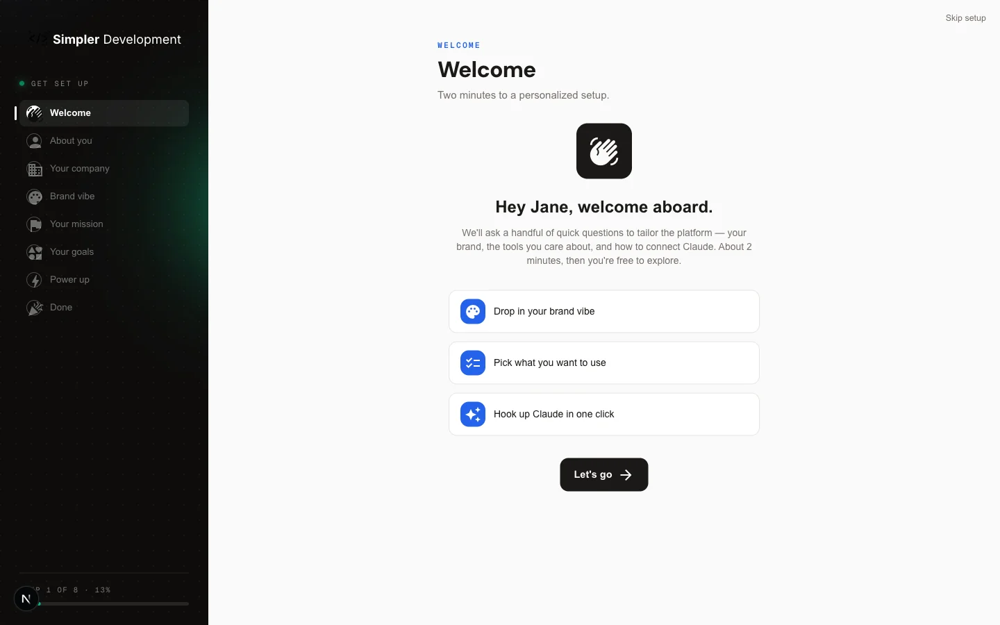
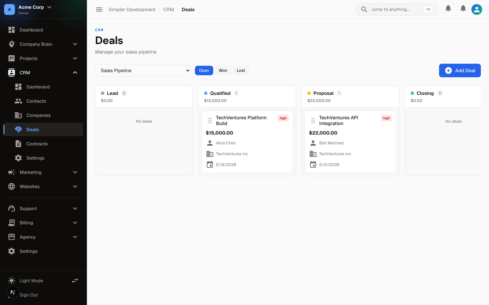
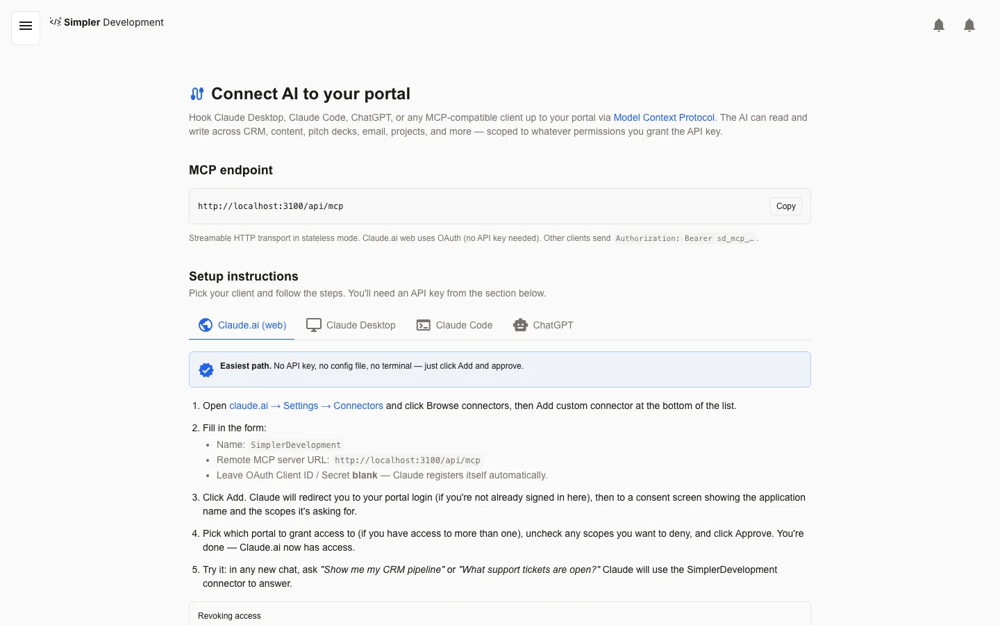
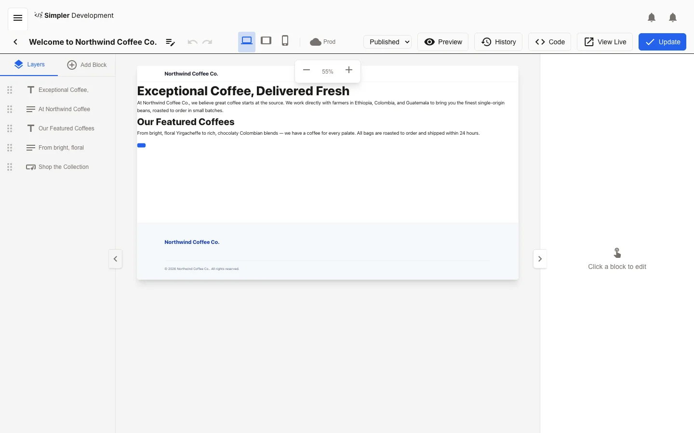

<p align="center">
  <picture>
    <source media="(prefers-color-scheme: dark)" srcset=".github/assets/logo-dark.png" />
    
  </picture>
</p>

# SimplerDevelopment

[](https://github.com/SimplerDevelopment/SimplerDevelopment/actions/workflows/ci.yml) [](LICENSE) [](CONTRIBUTING.md) [](https://bun.sh) [](tests/CI-GATES.md)

<p align="center">
  <a href="https://www.simplerdevelopment.com/api/media/proxy/media/1a9075a0-ac5e-4480-a11d-edae25fe5030.mp4">
    
  </a>
</p>

> ▶️ GitHub strips `<video>` embeds that point at external hosts, so the image above is a static hero. Click it (or [this link](https://www.simplerdevelopment.com/api/media/proxy/media/1a9075a0-ac5e-4480-a11d-edae25fe5030.mp4)) to watch the walkthrough.

## Overview

SimplerDevelopment is an open-source, self-hostable platform for agencies and operators — the stack you'd otherwise rent from Webflow, HubSpot, Notion AI, Calendly, Mailchimp, and DocuSign, rebuilt as one codebase you actually own. Per-tenant client **websites**, a **CRM**, an AI **Company Brain** (RAG over client knowledge), workflow **automations**, **bookings**, a **storefront**, **email** campaigns, **surveys**, **e-signatures**, and **Stripe billing** all live in a single multi-tenant portal.

Here's the part that makes it different: every one of those modules is driveable by an AI agent. The platform ships **450+ Model Context Protocol (MCP) tools**, so Claude, Cursor, or any MCP client can build a page, move a deal, or send a campaign the same way you would by clicking. Apache-2.0, no per-seat pricing, no rug-pull — bring your own Postgres and API keys and run it yourself.

### See it in action

| CRM pipeline | Company Brain — Ask | Visual editor |
|---|---|---|
| [](https://simplerdevelopment.com/solutions) | [](https://simplerdevelopment.com/solutions) | [](https://simplerdevelopment.com/solutions) |

More screenshots for every module: [simplerdevelopment.com/solutions](https://simplerdevelopment.com/solutions).

## Getting started

One command takes you from nothing to a running stack — it clones the repo, installs dependencies, and walks you through setup (secrets, database, seed data):

```bash
simpler create my-awesome-agency-platform
```

Don't have the `simpler` CLI yet? The same front door works through your package manager:

```bash
bunx create-simplerdevelopment my-awesome-agency-platform
# or
npm create simplerdevelopment@latest my-awesome-agency-platform
```

When it finishes, `cd` in and start the dev server — the portal is at [http://localhost:3000](http://localhost:3000):

```bash
cd my-awesome-agency-platform
bun dev
```

You'll want Docker (easiest — it brings its own Postgres) or Postgres 14+ with `pgvector`, plus Bun. The full walkthrough — manual setup, generating secrets, Docker vs. your own database, seeding, and troubleshooting — is in **[Getting Started →](docs/getting-started.md)**.

<p align="center">
  <a href="docs/getting-started.md"></a>
  &nbsp;·&nbsp;
  <a href="https://railway.com/new/template/simpler-development"></a>
</p>

## MCP

The whole platform is exposed to AI agents through an in-repo Model Context Protocol server (`app/api/mcp/route.ts` + `lib/mcp/`) — 450+ scoped tools spanning content, CRM, brain, commerce, email, bookings, and billing. Every tool carries a scope guard, so an agent can only reach what its key is allowed to.

- **Connect the Portal MCP** — wire up Claude.ai (OAuth), Claude Desktop/Code, or Cursor: **[`docs/mcp.md`](docs/mcp.md)**
- **MCP overview** — the full tool catalog, by domain: **[`docs/api/mcp/overview.md`](docs/api/mcp/overview.md)**

Prefer a terminal? The [`simpler` CLI](docs/developers/cli.md) drives the *same* tool surface from a shell or CI job without loading MCP schemas into an agent's context. Extending the server (handler + schema + scope guard, in lockstep) is covered in **[`docs/guides/MCP_TOOLS.md`](docs/guides/MCP_TOOLS.md)**.

## Features

Each product area is documented as a **domain** — a map of its key files, schema, routes, MCP tools, tests, and gotchas. Start at the index and follow the one you care about.

**[Feature domains index →](docs/agents/project-map.md)**

Websites & CMS · Visual Editor · Company Brain & AI · CRM · Bookings & Services · Storefront & Commerce · Email & Campaigns · Surveys · Pitch Decks · E-Sign & Approvals · Automations & Workflows · Billing & Stripe · Projects, Tickets & Kanban · Chat, Realtime & Voice · Agency, Onboarding & Branding · Integrations (Google, Microsoft, OAuth) · Plugins & Extension.

## Claude Skills

Repeatable work is packaged as [Claude](https://claude.com/claude-code) skills so the moving pieces never drift apart. There are two families:

- **Client skills** — author real portal content (pages, decks, emails, surveys, booking pages, HTML embeds, whole websites) by talking to the SD MCP. Overview: **[`docs/skills/SD-AUTHORING-SKILLS.md`](docs/skills/SD-AUTHORING-SKILLS.md)**. These also ship separately in the [`simplerdevelopment-skills`](https://github.com/SimplerDevelopment/simplerdevelopment-skills) repo for Claude Desktop.
- **Developer skills** — scaffold code with the invariants baked in: a CRUD resource (`simplerdev-feature-scaffold`), a CMS block type (`simplerdev-block-type`), or an MCP tool (`simplerdev-mcp-tool`). Reference: **[`docs/skills/SD-DEVELOPER-SKILLS.md`](docs/skills/SD-DEVELOPER-SKILLS.md)**.

New to the skill system? Start with the **[overview](docs/skills/SD-SKILLS-OVERVIEW.md)**.

## Agents & agentic development

This repo is built to be worked on by AI agents alongside humans — the agent tooling is first-class infrastructure, not an add-on. The root **[`CLAUDE.md`](CLAUDE.md)** and per-area nested `CLAUDE.md` files carry the operating rules; [`.claude/index.md`](.claude/index.md) maps "I need to work on X" to the right guide.

The unifying idea for building *your own* agents against the platform: **connect to the MCP server as a client and inherit all 450+ tools — never re-implement them.** [`simplerdevelopment-agents/`](simplerdevelopment-agents/) is the worked example.

- **Mastra** — two production agents built on [Mastra](https://mastra.ai): a deterministic *Workflow* for the Company Brain (classify → plan → tool-loop → groundedness check, with a scorer eval layer) and a *dynamic agent* portal assistant whose model and tools are chosen per request. Learn it here: **[`simplerdevelopment-agents/MASTRA_GUIDE.md`](simplerdevelopment-agents/MASTRA_GUIDE.md)**.
- **Mastra → Next.js** — how the agents service plugs into the parent app: in multi-tenant mode it holds *no* per-tenant secrets — the Next.js app mints a short-lived, single-tenant token per request and the MCP client fails closed without one. Architecture, setup, and the adoption path: **[`simplerdevelopment-agents/BRAIN_AGENT_README.md`](simplerdevelopment-agents/BRAIN_AGENT_README.md)**.
- **Crew AI** — a second reference implementation of the same MCP-client pattern is planned. *Coming soon.*

## Deployment

Production runs on Vercel (Next.js framework mode); every other pushed branch gets a preview deploy. Background work — embedding processing, Gmail/Drive watch renewal, automation scheduling, brain daily notes, usage rollup, booking reminders — runs as Vercel cron jobs defined in [`vercel.json`](vercel.json).

Want a one-click host with Postgres included? Use the **[Railway template](https://railway.com/new/template/simpler-development)** — setup notes in **[`docs/deploy/railway.md`](docs/deploy/railway.md)**.

## Sub docs

Dig deeper as you need it:

| Topic | Where |
|---|---|
| **Architecture overview** — route trees, tenancy, API envelope, block CMS | [`docs/agents/architecture-for-agents.md`](docs/agents/architecture-for-agents.md) |
| **Tech stack** | [see below](#tech-stack) |
| **.env configuration** | [`.env.example`](.env.example) (canonical, annotated) · [minimum-to-boot](docs/getting-started.md#the-minimum-to-boot) |
| **Dev & testing guide** | [`tests/TESTING_PLAN.md`](tests/TESTING_PLAN.md) |
| **CI/CD & coverage gates** | [`tests/CI-GATES.md`](tests/CI-GATES.md) |
| **Git hooks** | [`.githooks/`](.githooks/) (pre-commit / pre-push run the local CI gate) |
| **All project docs** | [`docs/`](docs/index.md) |

### Tech stack

| Layer | Choice |
|---|---|
| Framework / UI | Next.js 16 (App Router) · React 19 · TypeScript 5 · Tailwind CSS 4 |
| ORM / DB | Drizzle ORM + PostgreSQL (`pgvector`) |
| Auth | NextAuth v5 (beta) |
| Package manager | Bun — always `bun`, never `npm` |
| Tests | Vitest (unit/integration) · Playwright (e2e) |
| Realtime | Yjs + y-websocket (`packages/realtime-server`) |
| AI | Anthropic SDK · OpenAI (embeddings) |
| Integrations | Stripe (billing) · AWS S3 (storage) · Resend (email) · Sentry (errors) |

## Contributing

Contributions are welcome, and this codebase makes it easier than most — it ships with an unusually rich set of contributor docs. **[`CONTRIBUTING.md`](CONTRIBUTING.md)** explains how the monorepo is organized and how to add a block type, an MCP tool, or a CRUD resource; the root [`CLAUDE.md`](CLAUDE.md) and nested per-subsystem `CLAUDE.md` files document the architecture invariants. New here? Grab a [`good first issue`](../../issues?q=label%3A%22good+first+issue%22).

Use conventional commits (`feat(scope):`, `fix(scope):`, …). Run `bun run typecheck` and `bun test` before opening a PR; anything touching tenant data must also pass `bun test:tenancy`.

## Security

Found a vulnerability? Please **don't** open a public issue — see **[`SECURITY.md`](SECURITY.md)** for private disclosure.

## License

[Apache License 2.0](LICENSE) © SimplerDevelopment.
